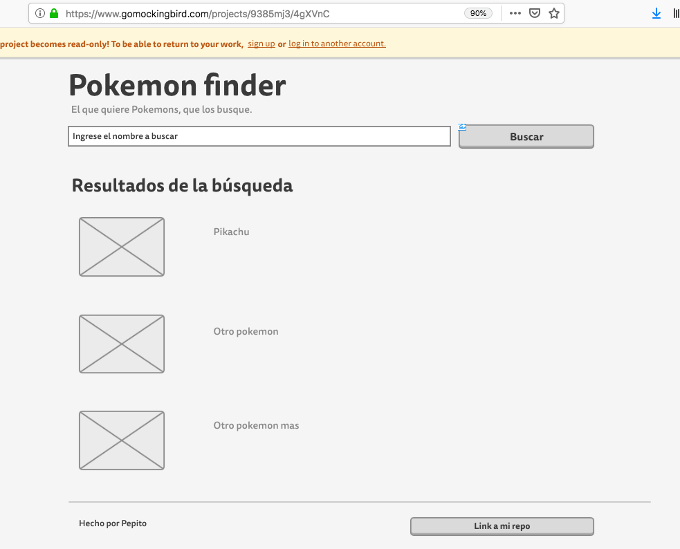

# ixpandit-tests
It asks to develop a web application to search for Pokemons.



The solution must meet the following requirements:

Use for the solution an object-oriented language (PHP, Java or similar) and automatic logic testing (Phpunit, JUnit).

The design of free choice, with the possibility of using a framework.

Check the data via PokeApi (https://pokeapi.co/) from the server (see image).

At a minimum you have to be able to search for Pokemons by partial name.

We will value simplicity and neatness. 

Also additions aimed at improving the quality of the code.

Share the solution in a public repo (Github, Bitbucket) with instructions to 
lift the application in the Readme. 

Send the repo link to it@ixpandit.com with the contact information.

# USAGE

```
$ git clone git@github.com:medinan/ixpandit-tests.git
$ cd ixpandit-tests/
$ docker-compose build api
$ docker-compose build web
$ docker-compose up api web

```

# User types

### Anonymous
Anonymous users can only get information from APIs, but cannot make changes

### Admin
The administrator users have all the permissions to interact with the APIs.

```commandline
user: admin
password: admin
```

# APIs documentation.
To document the APIs, the swagger [drf-yasg](https://drf-yasg.readthedocs.io/en/stable/) generator was used to access them you must enter http://0.0.0.0:8000/swagger/

# Tests
To run the tests run the following command.
```commandline
docker-compose run api python manage.py test -v 3
```

# Coverage
To run the coverage run the following command.

```commandline
docker-compose run api coverage  run --source='.' manage.py test
docker-compose run api coverage report
docker-compose run api coverage html
```

# Gitflow
For the development of the test, the following work scheme was used.

### Master branch
Any commit that we put in this branch must be prepared to go up to production.
Every time code is added to master, we have a new version of the product.

### Staging or Develop branch
Branch containing the code that will make up the next planned version of the project. (Integration-branch)

### Realease branches
Branch containing the code that will make up different versions of the system. 
They group branches of features and bug fixes. They leave master, 
they stay updated with respect to master (for releases that are not yet in production) 
and the 'release candidate' to go into production is merged into staging.

### Hotfix branches
These branches fix errors and bugs in the production code.
They work in a similar way to branch releases, but the difference is that 
hotfixes are performed on bugs that are clearly not planned. They go out and merge 
into master.

### Feature/Bugfix branches
Branches where the code that corresponds to the development of a ticket is located. 
They come out of the release to which they correspond and merge against it.


# Pending and improvements

1. automatic logic testing.
2Pokemon Card css.
3Add pokemon detail.
4Add more search methods.
5add more pokemon information.


