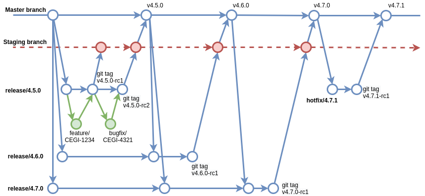

# ixpandit-tests
tests for ixpandit

# USAGE

```
$ git clone git@github.com:medinan/ixpandit-tests.git
$ cd test
$ docker-compose build api
$ docker-compose build web
$ docker-compose up

```

# APIs documentation.
To document the APIs, the swagger [drf-yasg](https://drf-yasg.readthedocs.io/en/stable/) generator was used to access them you must enter http://0.0.0.0:8000/swagger/

# Tests
To run the tests run the following command.
```commandline
docker-compose run api python manage.py test -v 3
```

# Coverage
To run the coverage run the following command.

```commandline
docker-compose run api coverage  run --source='.' manage.py test
docker-compose run api coverage report
docker-compose run api coverage html
```

# Gitflow
For the development of the test, the following work scheme was used.

### Master branch
Any commit that we put in this branch must be prepared to go up to production.
Every time code is added to master, we have a new version of the product.

### Staging or Develop branch
Branch containing the code that will make up the next planned version of the project. (Integration-branch)

### Realease branches
Branch containing the code that will make up different versions of the system. 
They group branches of features and bug fixes. They leave master, 
they stay updated with respect to master (for releases that are not yet in production) 
and the 'release candidate' to go into production is merged into staging.

### Hotfix branches
These branches fix errors and bugs in the production code.
They work in a similar way to branch releases, but the difference is that 
hotfixes are performed on bugs that are clearly not planned. They go out and merge 
into master.

### Feature/Bugfix branches
Branches where the code that corresponds to the development of a ticket is located. 
They come out of the release to which they correspond and merge against it.



# Pending and improvements

1. Support for subcategories.
2. List of products at user level, with the possibility of managing stock, price, tax.
3. Support for discounts and promotions.
4. Product review support.
5. Improve email templates.

# Proposal for the future
In the future depending on the growth of traffic in the service, 
it might be convenient to separate it into three clearly identifiable 
services Catalog, Event tracking and notifications connected asynchronously.


